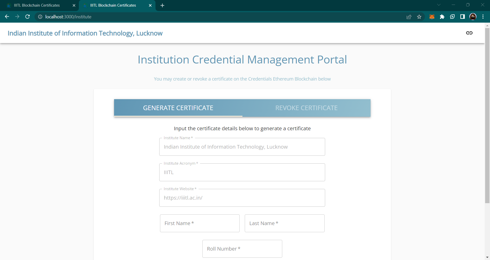

# IIITL-Certificates

---

## Use Cases
1. Issuing Certificates by Institutes
2. Revoking Certificates by Institutes
3. Viewing Certificates by Employers/Public

---

## ScreenShots
1. Landing Page

2. Interface to Issue a Certificate

---

## Team Members
1. [Anjali Chaudhary](https://github.com/anjali494)
2. [Ashna Agrawal](https://github.com/AshnaAgrawal2002)
3. [Palak Goel](https://github.com/palak123g)
4. [Soumya Baheti](https://github.com/soumya15o3)
